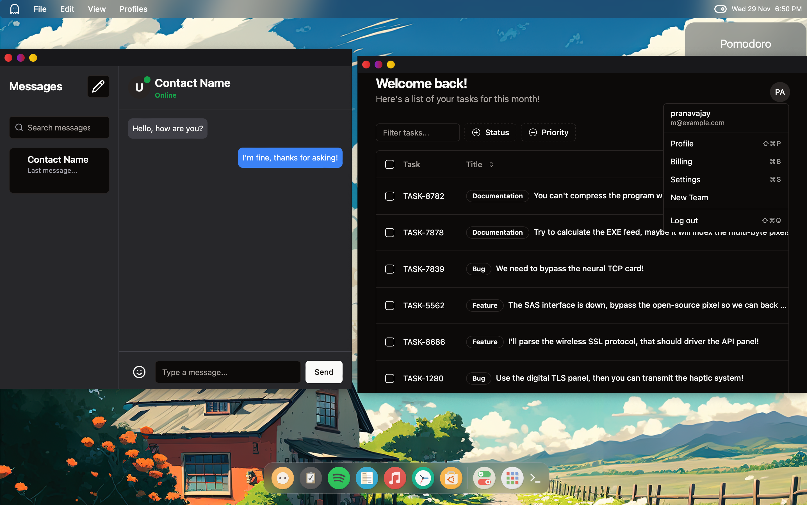

# SkyOS - React and Rust Based Desktop Environment Simulator

SkyOS is an ongoing project that aims to simulate a desktop environment inspired by macOS. It is built using React and Rust technologies. This desktop environment simulator is currently in development and is expected to offer a range of features to enhance user experience.

## Features

### 1. Functional Store
SkyOS will include a fully functional store where developers can publish Sky Apps, and users can seamlessly discover, download, and install them. This feature encourages a thriving ecosystem of applications that contribute to the versatility of the desktop environment.

### 2. Terminal Emulator
For users familiar with command-line interfaces, SkyOS provides a terminal emulator to execute basic terminal commands. This functionality is designed to cater to both developers and power users who prefer a text-based interface for certain tasks.

### 3. Productivity Tools
SkyOS prioritizes productivity by integrating a suite of tools, including but not limited to:
- **Todo List:** Organize your tasks efficiently.
- **Tasks Manager:** Keep track of ongoing projects and their progress.
- **Planner:** Plan your schedule and manage your time effectively.

and much more !!

### 4.Customizability

SkyOS stands out with its high level of customizability. Users can personalize their experience with custom icon packs and modify the OS look to suit their individual preferences.

### 5. Dock
Enjoy the convenience of a sleek and customizable dock, reminiscent of the macOS experience. The dock provides quick access to your favorite applications, making navigation a breeze.

### 6. Widgets
SkyOS has a widget system to enhance your desktop experience. Widgets are small, functional components that provide real-time information and quick access to specific features. Stay updated on the weather, monitor system resources, and more with the included widgets

# Development Status

SkyOS is actively under development, with new features and improvements being added regularly. Contributions from the community are welcome, and developers are encouraged to participate in enhancing the project.

#### Dock

*Customizable and sleek dock for quick application access.*

#### Widgets

*Small, functional components providing real-time information.*

#### Home

#### Can run web Apps!

*This image shows spotify web app.*

#### Sky Apps

*Sky, straight out of the box, includes a set of default apps designed to enhance your productivity.*

## License

SkyOS is licensed under the MIT License, granting users the freedom to use, modify, and distribute the software.

Note: SkyOS is a desktop environment simulator and is not intended to replace or replicate macOS. It is an independent project inspired by the design and functionality of macOS and it not meant to run as a full-blown DE.

For more information and updates, visit the SkyOS GitHub Repository.