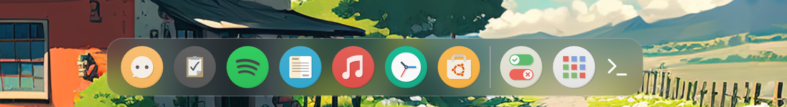
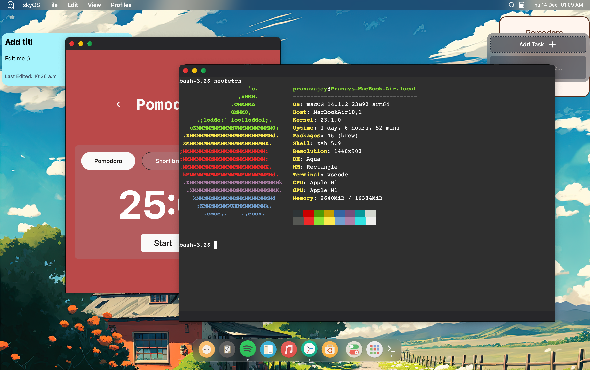
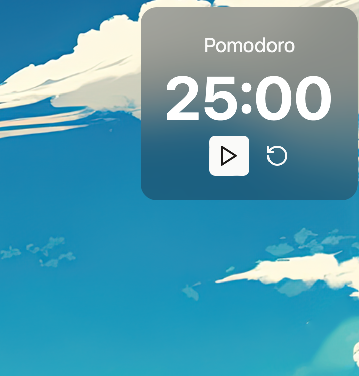

<br/>
<p align="center">
  <a href="https://github.com/skai-org/skyOS">
    
  </a>

  <h3 align="center">skyOS</h3>

  <p align="center">
    Sky is a productivity focused Digital Environment simulating the MacOS UI
    <br/>
    <br/>
    <a href="https://github.com/skai-org/skyOS/issues">Report Bug</a>
    .
    <a href="https://github.com/skai-org/skyOS/issues">Request Feature</a>
  </p>
</p>

      


<p id="description">This is a hobby project built with React and Tauri that aims to simulate a desktop environment similar to macOS.<br>This simulator is currently under development 🚧👷🏻 and is expected to offer a range of features to enhance user experience.</p>

<h2>Project Screenshots:</h2>





  

  
<h2>🧐Current Features</h2>

Here're some of the project's best features:

*   An app dock
*   Draggable widgets
*   Basic apps
*   A functional terminal
*   Desktop Environment Simulation:
*   Cross-Platform Compatibility

<h2>🛠️ Installation Steps:</h2>

<p>1. Setup</p>

```
Make sure you have Node.js and npm as well as Rust installed.  Then run npm to install the dependencies.
```

<p>2. Running</p>

```
npm run tauri dev
```

  
  
<h2>💻 Built with</h2>

Technologies used in the project:

*   Rust
*   Tauri
*   Typescript
*   React JS

## Roadmap


See the open issues for a list of proposed features (and known issues).

## Contributing

This project is currently in its early stages, and your early contributions are highly valued :).

### How to Contribute

If you have suggestions for adding or removing projects, feel free to open an issue to discuss it, or directly create a pull request.

  


