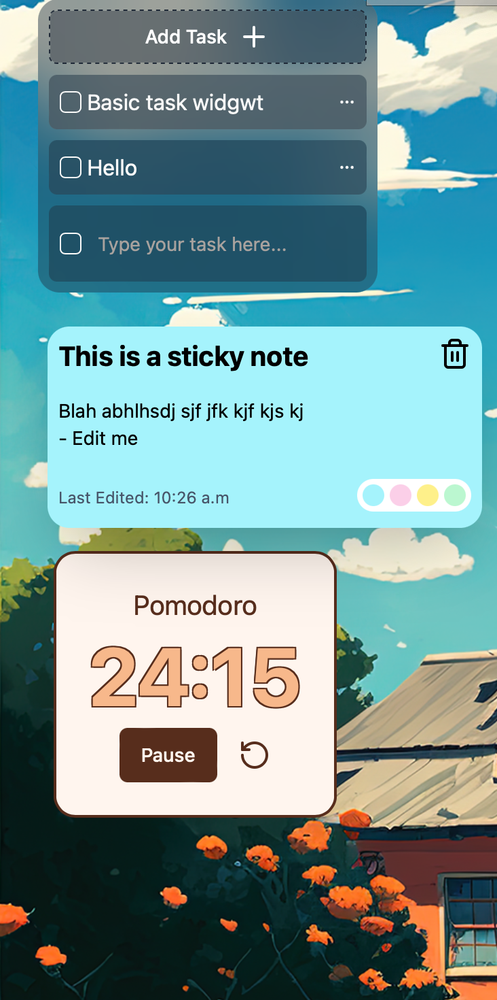

# SkyOS - React and Rust Based Desktop Environment Simulator

SkyOS is an ongoing project that aims to simulate a desktop environment inspired by macOS. It is built using React and Tauri. This simulator is currently in development and is expected to offer a range of features to enhance user experience. 

# Development Status

SkyOS is currently under development. 

#### Dock

*Sleek dock for quick application access.*

#### Widgets

*Small, functional components providing real-time information.*

#### Home

#### Can run web Apps!

*This image shows spotify web app.*

#### Sky Apps

*Straight out of the box, includes a set of productivity apps.*

#### Functional terminal

*Sky offers an inbuilt terminal developed using Xtermjs.*

